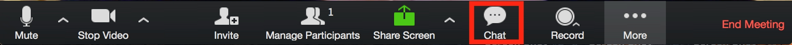

```{r xaringan-themer, include = FALSE}
library(xaringanthemer)
mono_light(
  base_color = "midnightblue",
  header_font_google = google_font("Josefin Sans"),
  text_font_google   = google_font("Montserrat", "300", "300i"),
  code_font_google   = google_font("Droid Mono"),
  link_color = "deepskyblue1",
  text_font_size = "28px"
)
```

class: center, middle

```{r setup, include=FALSE}
options(htmltools.dir.version = FALSE)
```
# Welcome

---
# Ted Laderas, PhD 

.pull-left[
- Assistant Professor, Division of Bioinformatics and Computational Biology, Department of Medical Informatics and Clinical Epidemiology 
- Bioinformatics/Computational Biology
- Interactive Visualization
- Certified RStudio Instructor 
- Co-founder of [BioData Club](http://biodata-club.github.io)] and [Cascadia-R Conference](https://cascadiarconf.com)

.pull-right[]

---
# Class Facilitator/TA

- Meet Eric Leung from DMICE
- He will be helping me faciliate online sessions
- Also will be grading and will be available for questions

---
# Introduction Overview

- Introduction to Zoom
- Learning Objectives
- Class Logistics

---
# First of All

- This is a brand new course
- Let's support each other
    - Be gentle with each other
- I expect to make many mistakes
    - I don't mind you pointing them out, but be gentle
    - You can end up as a collaborator!

---
# Tour of Zoom

- We'll be using zoom for our classes
- Let's do a quick guided tour

---

<iframe width="1000" height = "600" src="https://www.youtube.com/embed/5iap0Ffl5Lg" frameborder="0" allow="accelerometer; autoplay; encrypted-media; gyroscope; picture-in-picture" allowfullscreen></iframe>

---
# Letting me Know

When we're doing the activity, use the hands up in Zoom to indicate that you're finished.

If you have questions, please ask them in chat.

---
# Let's Try Out Chat

Open the chat window (if we are in full screen, press the escape key, and then click on the chat icon)



Type in Chat:

- Your Name
- Your Year
- What you hope to learn from this course

---
# 5 minute meeting

Please schedule a time here: 

It helps me to understand why you're in the course and what you want to learn


---
# Rules for Interaction

During Class

- Post questions in Chat
    - Eric will interrupt me to make sure these questions are answered
- Post answers to questions in chat if you know them
- You can unmute as well

---
# Rules for Interaction

During Class

- Work with your buddy if we're working on a lab 
- Share screens to talk about issues

---
# Sharing Your Screen


---
# Function of the Week

- Learn and share about an underrated `tidyverse()` function
- Pick a week to present here: 
- Share your experience with the function
  - Is it useful?
  - Is it hard to use?
  - Share an example
- You will have time to meet with me befor you present
  
---
# Midterm / Final Project

- Midterm: Pick a dataset and show that you can explore it, plot it, and transform it to answer a specific question
  - Schedule a meeting to discuss the data
- Final: Pick a different dataset and build a model using machine learning or statistics
  - 
---
# Let's try the Breakout Rooms

- Let's try it (3 minutes)
- Icebreaker: What is your favorite all purpose condiment (such as salsa, ketchup, or chile oil?) and why?

---
# Zoom Recordings/Attendance

- I will record each session and Eric will post it as soon it is ready
- I will pause recording for breakout rooms (that won't be recorded)

---
class: center, middle

# Let's look at the website:
## http://sph-r-programming.netlify.app

---
class: center, middle

# Class Logistics

---
# Learning Objectives

By the end of this course you will be able to:

1. **Understand** and **utilize** **R/RStudio**.
2. **Understand** basic data types and data structures in R.
3. **Familiarize** and **load** data files (Excel, Comma Separated Value files) into R/Rstudio, with tips on formatting.
4. **Visualize** datasets using **ggplot2** and understand how to build basic plots using **ggplot2** syntax.
5. **Filter** and **format** data in R for use with various routines.
6. **Execute** and **Interpret** some basic statistics in R.
7. **Automate** repetitive tasks in R, such as loading a folder of files.
8. **Execute** basic machine learning workflows using `tidymodels`.
9. **Your Choice**: `shiny`, `leaflet` or `tidytext`.

---
# Caveat Emptor

- This is *not* a conventional programming course
- We try to get you doing interesting and useful things from the beginning
- This is also *not* a full course on statistics or machine learning

---
# My Approach to Teaching

I think students learn the best when they're actually looking and thinking about data.

This means we will be looking at lots of data.

---
# Social Learning Works

I also think that we learn best when we are discussing data together.

---
class:center, middle
# This is a Safe Space to Ask Questions

---
# Code of Conduct

This class is governed by the [BioData Club Code of Conduct](https://biodata-club.github.io/code_of_conduct/).

This class is meant to be a psychologically safe space where it's ok to ask questions.

I want to normalize your own curiosity and fuel your desire to learn more.

If you are disruptive to class learning or disparaging to other students, I may mute you for the day.

---
# Code of Conduct Violations

Please report them here: 

---
# Class Discord

- [Slack 101 Videos](https://slack.com/resources/slack-101)

---
# Class Attendance Policy

Please try to attend class. 

There is a post-class survey that will be posted. Please fill it out, as it counts as attendance.

If you can't attend class, please let me know.

---
# Office Hours

I will be available for office hours/drop in time 2 Hours a week (Sam will be available once a week). You're free to sign in to the Zoom Room and work on homework at this time.

When is good link: 

Highlight all times that work for you.

---
# Class Assignments

Class Assignments will be done in RStudio Notebooks

Assignments will be submitted through Sakai. 

We will do our best to return it to you within a week.

We will highlight any points of confusion

---
# Why R?

R is an extremely powerful language for **statistical modeling**, machine learning, data manipulation, and visualization.

It's a *hub* language in that you can access many different kinds of systems (TensorFlow, Databases, Apache Spark) without needing to know other languages.

---
# R is Not Easy

- Learning R can be a difficult, but rewarding process
- Be patient with yourself, don't beat yourself up
- We'll try to make it a fun process for you

---
# Grading Breakdown

- In class discussion 10%
- Midterm 15%
- Homework Assignment (from labs) 50%
- Final Project 20%

---
# Format of Class

- Office Hours (2 hrs/week)

---
# R and RStudio

- In-class labs and assignments will be done with [RStudio.cloud](http://rstudio.cloud)
- We'll take a guided tour of RStudio Cloud

---
# Other Resources/Events (Optional)

- [PDX R User Group Meetup]() (monthly)
- BioData Club: Intro to Shiny Workshop (1/21) 
  - Sign up here: 
- Cascadia R Conference 2021 will be online in May or June

---
class: center, middle

# Any Questions?